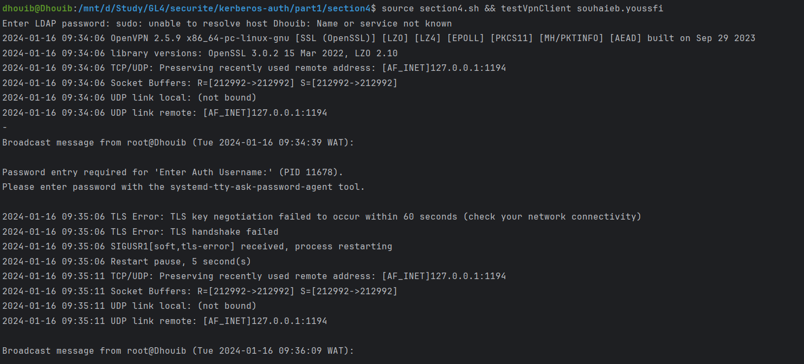

# **Section 4: OpenVPN with LDAP Authentication**
## **Introduction**
This section outlines the process of setting up OpenVPN with LDAP authentication. Follow these steps to install and configure OpenVPN, integrate LDAP authentication, and test VPN connections for authorized and unauthorized users.

## **Using the Script**
___Step 1: Install OpenVPN and Dependencies___ 
Run the following command to install OpenVPN and necessary dependencies:

~~~sh
installOpenVpn
~~~
___Step 2: Configure OpenVPN Server with LDAP Authentication___ 
Execute the following commands to generate SSL certificates, copy configuration files, and restart the OpenVPN service:

~~~sh
configureOpenVpn
~~~
___Step 3: Test VPN Connection___ 
The following command attempts a VPN connection to localhost. 
~~~sh
 source ./section3.sh && testWebAccess
   ~~~
If you want to test for a specific user, provide the LDAP username as an argument:
~~~sh
 source ./section3.sh && testWebAccess <LDAP_USERNAME>
   ~~~

We can test web access for the user "souhaieb.youssfi" with the password "souheib". This user is allowed to create a vpn connection based on the LDAP configuration since he is in the teachers group.
~~~sh
 source ./section3.sh && testWebAccess souhaieb.youssfi
   ~~~

You should see a successful response indicating that the vpn connection is created for the authorized user.